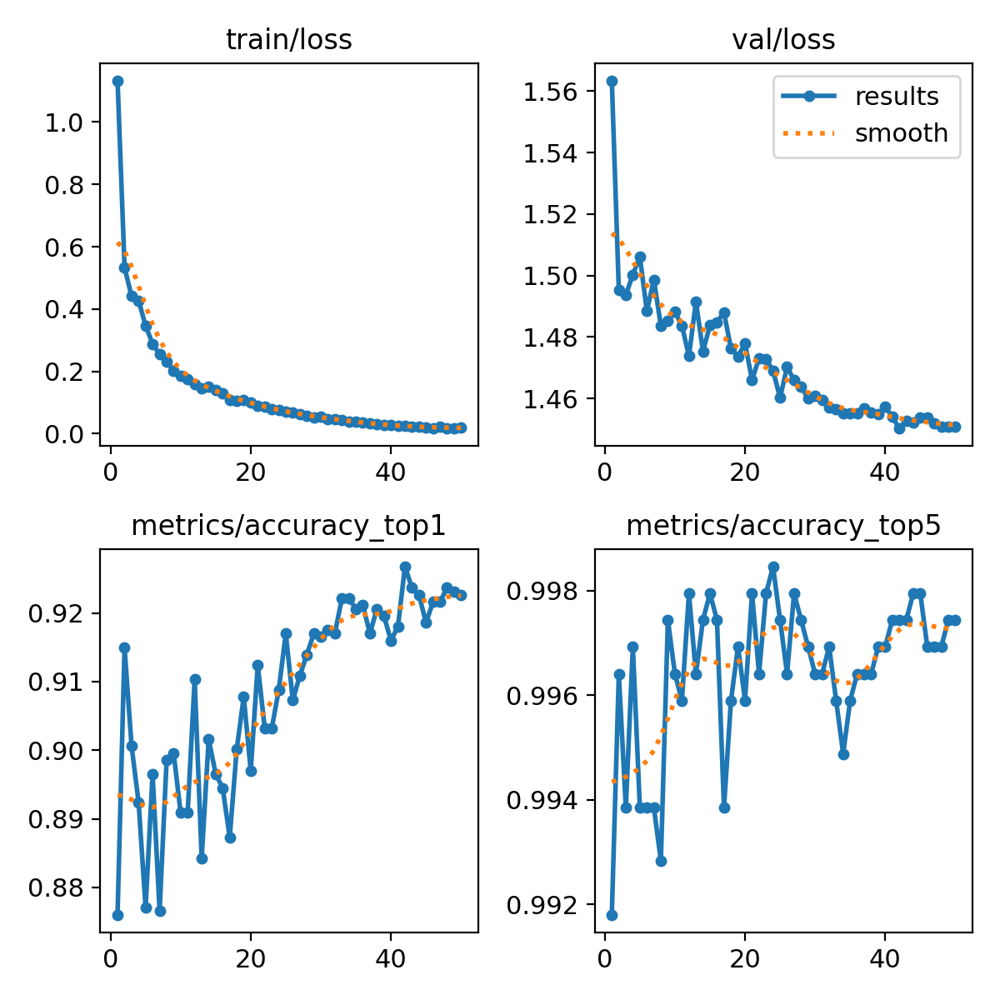

# Waste Classification Streamlit App

This repository contains a Streamlit application for waste classification using an AI model developed with YOLOv8m-cls. The application can accurately classify waste into 10 categories:

- **biodegradable**  
- **cardboard**  
- **glass**  
- **gloves**  
- **masks**  
- **medicines**  
- **metal**  
- **paper**  
- **plastic**  
- **syringe**
- 
---

## Project Overview

The aim of this project is to promote environmental awareness and waste management by leveraging AI technology. The model was trained on a comprehensive dataset with 17,500 images and demonstrates high accuracy in classifying waste into the specified categories.

### Key Features:
- **Real-time Waste Classification**: Upload an image to see its predicted waste category.
- **Interactive Visuals**: The application provides visualizations of predictions and classification performance.
- **User-Friendly Interface**: Built with Streamlit for ease of use.

---

## Model Training Details

The model was trained using **YOLOv8m-cls** in a Google Colab environment. The training parameters and steps are as follows:

1. **Environment Setup**:  
   Mounted Google Drive and set the working directory.  

   ```python
   from google.colab import drive
   drive.mount("/content/drive")
   import os
   colab_dir = "/content/drive/MyDrive/Waste_classification"
   os.chdir(colab_dir)

2. **Data Preparation**:  
   The dataset was extracted and organized. It contains 10 waste categories with images pre-processed (auto-oriented, resized to 224x224 pixels).  

   ```python
   !unzip Classification_waste.zip

3. **Training Command**:  
   The model was trained for 50 epochs with the following command:
   ```python
   !yolo task=classify mode=train model=yolov8m-cls.pt data="/content/drive/MyDrive/Waste_classification/Classification_waste 2/data" epochs=50 imgsz=224

---

## Results and Visualizations

### Confusion Matrix (Normalized)
The confusion matrix highlights the performance of the model across different categories.  
---


### Training Results
Visualization of training metrics such as accuracy, loss, and learning rate.  
---


### Sample Predictions
Here are some sample predictions made by the model:

- **Training Batch Visualization**
  ---  
  

---

- **Validation Predictions**  
  

  ---
  
  


---

## Acknowledgments

This project was built using:

- **YOLOv8m-cls**: For robust classification capabilities.
- **Streamlit**: For creating a user-friendly interface.
- **Roboflow**: For providing a high-quality dataset.

